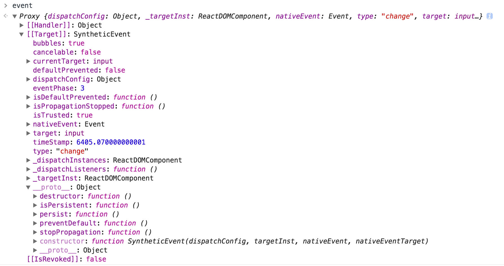
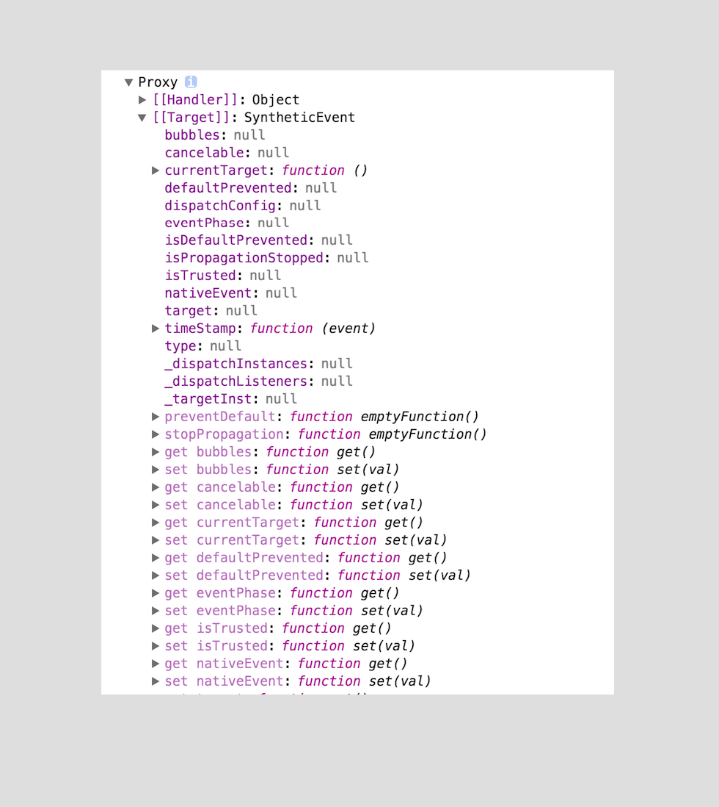

>[SyntheticEvent](https://facebook.github.io/react/docs/events.html)

# SyntheticEvent
本篇介绍React事件系统一部分：SyntheticEvent包装器。 更多信息请参考 [事件处理](../React快速开始/React快速开始（六）事件处理.md)。
## 总览
React事件处理程序将会传递SyntheticEvent实例，SyntheticEvent是对浏览器原生事件的跨浏览器包装，React事件与浏览器原生事件的不同在于：能在所有浏览器上工作。React事件具有与浏览器原生事件相同的接口，包括stopPropagation()和preventDefault()

>注意：
> 用addEventListener绑定的事件是浏览器原生事件，在组件卸载componentWillUnmount时需要removeEventListener。
> 
> 在JSX中绑定的事件是合成事件，组件卸载时会自动清除绑定的事件。

如果您需要底层浏览器事件，只需使用nativeEvent属性即可获取。 每个SyntheticEvent对象都具有以下属性：

```
boolean bubbles
boolean cancelable
DOMEventTarget currentTarget
boolean defaultPrevented
number eventPhase
boolean isTrusted
DOMEvent nativeEvent
void preventDefault()
boolean isDefaultPrevented()
void stopPropagation()
boolean isPropagationStopped()
DOMEventTarget target
number timeStamp
string type
```

注意： 从v0.14版本开始，在事件处理程序中返回false不会阻止事件传播，我们需要手动触发 e.stopPropagation() 或 e.preventDefault()

这里我举个例子：

```javascript
class MyComponent extends React.Component{
	changeHandler(event){
		debugger;
		console.dir(event);
		console.log(event.type);
	}
	render(){
	  return(
	  	<input onChange={this.changeHandler.bind(this)}/>
	  )
	}
}

ReactDOM.render(
  <MyComponent />,
  document.getElementById('root')
);
```
debugger查看event对象：


控制台打印出来的event对象：


发现控制台打印出来的event对象属性都变成了null，但是访问event.type又能获取到'change'，这是怎么回事呢？请看下一节~

### 事件池
React为SyntheticEvent对象分配了一个事件池，调用事件处理函数后，SyntheticEvent对象所有属性都将被丢弃，然后可以被重用，这主要是考虑到性能。 因此，我们无法以异步方式访问事件。

```javascript
function onClick(event) {
  console.log(event); // => event object对象属性值都被丢弃了
  console.log(event.type); // => "click"  在这里还是能获取到event.type的
  const eventType = event.type; // => "click"

  setTimeout(function() {
    console.log(event.type); // => null   在这里就拿不到event.type了
    console.log(eventType); // => "click"
  }, 0);

  // Won't work. this.state.clickEvent只会包含null值.
  this.setState({clickEvent: event});

  // 但是仍然可以导出event对象的属性。
  this.setState({eventType: event.type});
}
```
>**注意：**
>如果要以异步方式访问事件属性，则应调用event.persist()，这会从池中删除合成事件，并允许用户代码保留对该事件的引用。

上面的例子，在setTimeout中访问event.type得到的是null，同时也会接收到一个警告：

<p style="color:red;">Warning: This synthetic event is reused for performance reasons. If you're seeing this, you're accessing the property `type` on a released/nullified synthetic event. This is set to null. If you must keep the original synthetic event around, use event.persist(). See <a href='https://fb.me/react-event-pooling'>https://fb.me/react-event-pooling</a> for more information.</p>

## 支持的事件
React将事件规范化了，使事件在不同浏览器之间具有一致的属性。

下面的事件处理程序在冒泡阶段触发。 如果要在捕获阶段注册事件处理程序，请将Capture附加到事件名称后; 例如，click事件在捕获阶段的事件处理程序使用onClickCapture，而不是onClick。

- Clipboard Events
- Composition Events
- Keyboard Events
- Focus Events
- Form Events
- Mouse Events
- Selection Events
- Touch Events
- UI Events
- Wheel Events
- Media Events
- Image Events
- Animation Events
- Transition Events

## 参考
### 剪贴板事件（Clipboard Events）
事件名称：

```
onCopy onCut onPaste
```
属性：

```
DOMDataTransfer clipboardData
```
### 合成事件（Composition Events）
事件名称：

```
onCompositionEnd onCompositionStart onCompositionUpdate
```
属性：

```
string data
```
### 键盘事件（Keyboard Events）
事件名称：

```
onKeyDown onKeyPress onKeyUp
```
属性：

```
boolean altKey
number charCode
boolean ctrlKey
boolean getModifierState(key)
string key
number keyCode
string locale
number location
boolean metaKey
boolean repeat
boolean shiftKey
number which
```
### 焦点事件（Focus Events）
事件名称：

```
onFocus onBlur
```
属性：

```
DOMEventTarget relatedTarget
```
### 表单事件（Form Events）
事件名称：

```
onChange onInput onSubmit
```
关于onChange的更多信息参考 [Form](../React快速开始/React快速开始（九）表单.md)
### 鼠标事件（Mouse Events）
事件名称：

```
onClick onContextMenu onDoubleClick onDrag onDragEnd onDragEnter onDragExit
onDragLeave onDragOver onDragStart onDrop onMouseDown onMouseEnter onMouseLeave
onMouseMove onMouseOut onMouseOver onMouseUp
```
The onMouseEnter and onMouseLeave events propagate from the element being left to the one being entered instead of ordinary bubbling and do not have a capture phase.(这段不知道怎么翻译比较准确，mouseenter和mouseleave是不冒泡的)

属性：

```
boolean altKey
number button
number buttons
number clientX
number clientY
boolean ctrlKey
boolean getModifierState(key)
boolean metaKey
number pageX
number pageY
DOMEventTarget relatedTarget
number screenX
number screenY
boolean shiftKey
```
### 选择事件（Selection Events）
事件名称：

```
onSelect
```

### 触摸事件（Touch Events）
事件名称：

```
onTouchCancel onTouchEnd onTouchMove onTouchStart
```
属性：

```
boolean altKey
DOMTouchList changedTouches
boolean ctrlKey
boolean getModifierState(key)
boolean metaKey
boolean shiftKey
DOMTouchList targetTouches
DOMTouchList touches
```
### UI Events
事件名称：

```
onScroll
```
属性：

```
number detail
DOMAbstractView view
```
### 滚轮事件（Wheel Events）
事件名称：

```
onWheel
```
属性：

```
number deltaMode
number deltaX
number deltaY
number deltaZ
```
### 多媒体事件（Media Events）
事件名称：

```
onAbort onCanPlay onCanPlayThrough onDurationChange onEmptied onEncrypted 
onEnded onError onLoadedData onLoadedMetadata onLoadStart onPause onPlay 
onPlaying onProgress onRateChange onSeeked onSeeking onStalled onSuspend 
onTimeUpdate onVolumeChange onWaiting
```

### 图像事件（Image Events）
事件名称：

```
onLoad onError
```

### 动画事件（Animation Events）
事件名称：

```
onAnimationStart onAnimationEnd onAnimationIteration
```
属性：

```
string animationName
string pseudoElement
float elapsedTime
```
### 渐变事件（Transition Events）
事件名称：

```
onTransitionEnd
```
属性：

```
string propertyName
string pseudoElement
float elapsedTime
```