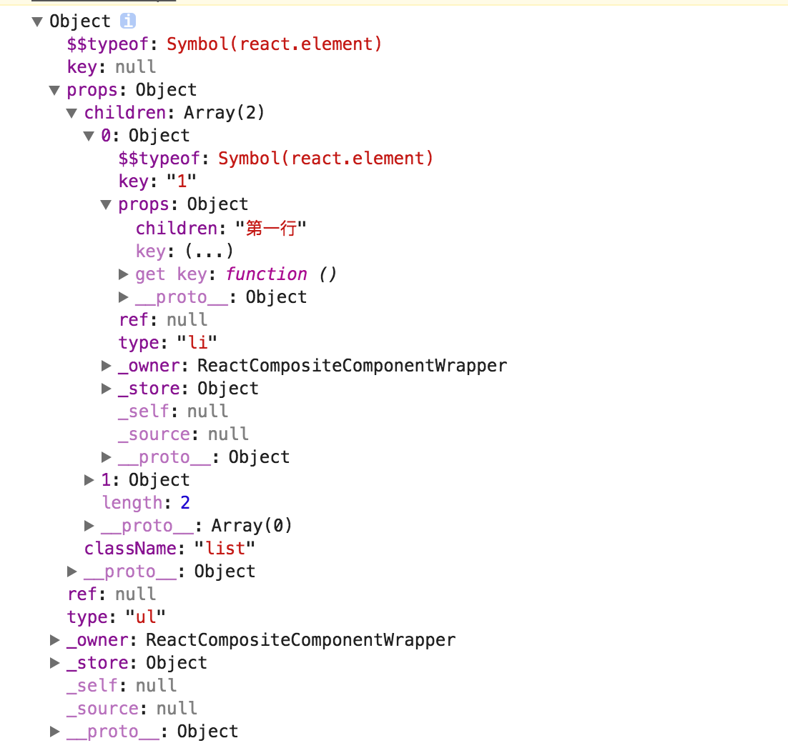

>[React Components, Elements, and Instances](https://facebook.github.io/react/blog/2015/12/18/react-components-elements-and-instances.html)

# React组件、元素和实例
许多React初学者会将组件，实例和元素混淆。 为什么有三个不同的术语来表示UI界面呢？

## 管理实例
如果您是React新手，那么您之前可能用到了组件类和实例。 例如，您可以通过创建一个类来声明一个Button组件。当应用程序运行时，屏幕上可能具有此组件的多个实例，每个实例具有其自己的属性和本地状态。这是传统的面向对象UI编程。 那为什么还要引入元素这个概念呢？

在这个传统的UI模型中，你需要关心子组件实例的创建和销毁。 如果一个Form组件想要渲染一个Button组件，它需要创建它的实例，并手动更新最新的数据。

```javascript
class Form extends TraditionalObjectOrientedView {
  render() {
    // 读取传递给view的一些数据
    const { isSubmitted, buttonText } = this.attrs;

    if (!isSubmitted && !this.button) {
      // Form 还没有提交，创建一个button!
      this.button = new Button({
        children: buttonText,
        color: 'blue'
      });
      this.el.appendChild(this.button.el);
    }

    if (this.button) {
      // 如果 button 已经存在了. 更新button的内容!
      this.button.attrs.children = buttonText;
      this.button.render();
    }

    if (isSubmitted && this.button) {
      // Form 提交后， 移除 button!
      this.el.removeChild(this.button.el);
      this.button.destroy();
    }

    if (isSubmitted && !this.message) {
      // Form提交后，显示提交成功!
      this.message = new Message({ text: 'Success!' });
      this.el.appendChild(this.message.el);
    }
  }
}
```
这是一段伪代码，但如果你使用像Backbone这样的库以面向对象的方式来编写复合UI，差不多就是这样的。
每个组件实例都必须保持对其DOM节点和子组件的实例的引用，并在适当的时候创建、更新和销毁它们，如此代码量可能会随着组件状态的增加成指数增长，并且父组件可以直接访问子组件实例，难以将其分离。

那么使用React会怎么样呢？

## 用元素描述树
在React中，使用元素能够解决这个问题。 **元素是描述组件实例或DOM节点及其所需属性的简单对象。** 它仅包含组件类型（例如Button）、属性（例如，其颜色）以及它的子元素这些信息。

元素不是实例，是一种告诉React你想在屏幕上看到什么的方式，您不能在元素上调用任何方法，它只是一个不可变的描述对象，它有两个字段：```type:(string | ReactClass)``` 和```props：Object```。

**出于 [安全原因](https://github.com/facebook/react/pull/4832)，所有React元素需要声明一个额外的\$\$typeof属性：** ```$$typeof: Symbol.for('react.element') ```

例如下面这个元素：

```html
<ul className='list'>
 	<li key='1'>第一行</li>
 	<li key='2'>第二行</li>
</ul>
```

它的对象表示是：




### DOM 元素
当元素的类型是字符串时，它表示具有该标记名称的DOM节点，props对应于其属性。 这就是React要呈现的内容。 例如：

```
{
  type: 'button',
  props: {
    className: 'button button-blue',
    children: {
      type: 'b',
      props: {
        children: 'OK!'
      }
    }
  }
}
```
这个元素只是将以下HTML表示为一个普通对象：

```html
<button class='button button-blue'>
  <b>
    OK!
  </b>
</button>
```

注意元素是如何嵌套的，当我们要创建一个元素树时，我们指定一个或多个子元素作为它们的包含元素的props.children。

重要的是，子元素和父元素都只是描述而不是实际的实例。 当您创建它们时，它们不会指向屏幕上的任何内容，你可以创建它们并将它们丢弃，这都没有关系。

React元素很容易遍历，不需要被解析，当然它们比实际的DOM元素要轻得多，因为它们只是对象！
### 组件元素
然而，元素类型也可以是对应于React组件的函数或类：

```
{
  type: Button,
  props: {
    color: 'blue',
    children: 'OK!'
  }
}
```
这是React的核心思想。

**描述组件的元素也是一个元素，就像描述DOM节点的元素一样。 它们可以嵌套并相互混合。**

此特性允许您将DangerButton组件定义为具有特定颜色属性值的Button，而不必担心Button是否渲染到DOM &lt;button>，&lt;div>或其他容器中：

```javascript
const DangerButton = ({ children }) => ({
  type: Button,
  props: {
    color: 'red',
    children: children
  }
});
```

您也可以在单个元素树中混合嵌套DOM元素和组件元素：

```javascript
const DeleteAccount = () => ({
  type: 'div',
  props: {
    children: [{
      type: 'p',
      props: {
        children: 'Are you sure?'
      }
    }, {
      type: DangerButton,
      props: {
        children: 'Yep'
      }
    }, {
      type: Button,
      props: {
        color: 'blue',
        children: 'Cancel'
      }
   }]
});
```
或者，使用JSX:

```xml
const DeleteAccount = () => (
  <div>
    <p>Are you sure?</p>
    <DangerButton>Yep</DangerButton>
    <Button color='blue'>Cancel</Button>
  </div>
);
```

这种混合和匹配有助于使组件彼此分离，因为它们可以通过组合来表达is-a和has-a关系：

- Button是具有特定属性的DOM  &lt;button> 
- DangerButton是具有特定属性的Button
- DeleteAccount在&lt;div>中包含一个Button和一个DangerButton


### 组件封装元素树
当React看到具有函数或类类型的元素时，它会向该组件询问根据给定的props返回的元素是什么。

当React看到这样一个元素：

```
{
  type: Button,
  props: {
    color: 'blue',
    children: 'OK!'
  }
}
```

React会问Button它要呈现的是什么，Button将返回此元素：

```
{
  type: 'button',
  props: {
    className: 'button button-blue',
    children: {
      type: 'b',
      props: {
        children: 'OK!'
      }
    }
  }
}
```
React将会重复这个过程，直到它知道页面上每个组件的底层DOM标签元素。

React就像一个孩子，对于“Y是什么”这样的问题，你都要向它解释“X 是 Y”，直到他们弄清楚世界上每一个小东西。

还记得前面Form表单的例子吗？在React中他可以这样写：

```javascript
const Form = ({ isSubmitted, buttonText }) => {
  if (isSubmitted) {
    // Form submitted! Return a message element.
    return {
      type: Message,
      props: {
        text: 'Success!'
      }
    };
  }

  // Form is still visible! Return a button element.
  return {
    type: Button,
    props: {
      children: buttonText,
      color: 'blue'
    }
  };
};
```
仅此而已！对于React组件，props是输入，元素树是输出。

返回的元素树即可以包含描述DOM节点的元素也可以包含描述其他组件的元素。 这允许您将UI的独立部分进行组合，而不需要依赖于其内部DOM结构。

**React负责管理实例，创建、更新和销毁实例，并使用从组件返回的元素来描述它们。**

### 组件可以是类或函数
在上面的代码中，Form，Message和Button都是React组件。 如上所述，它们可以被写为函数，也可以是从React.Component继承的子类。 声明组件的这三种方式大部分情况下是等效的：

```javascript
// 1) As a function of props
const Button = ({ children, color }) => ({
  type: 'button',
  props: {
    className: 'button button-' + color,
    children: {
      type: 'b',
      props: {
        children: children
      }
    }
  }
});

// 2) Using the React.createClass() factory
const Button = React.createClass({
  render() {
    const { children, color } = this.props;
    return {
      type: 'button',
      props: {
        className: 'button button-' + color,
        children: {
          type: 'b',
          props: {
            children: children
          }
        }
      }
    };
  }
});

// 3) As an ES6 class descending from React.Component
class Button extends React.Component {
  render() {
    const { children, color } = this.props;
    return {
      type: 'button',
      props: {
        className: 'button button-' + color,
        children: {
          type: 'b',
          props: {
            children: children
          }
        }
      }
    };
  }
}
```

当一个组件被定义为一个类时，它比函数组件更强大一些。 当相应的DOM节点被创建或销毁时，它可以存储一些本地状态并执行自定义逻辑。（state、ref、生命周期钩子函数）

函数组件的功能不那么强大，但更简单，就像一个只有render()方法的类组件。 除非您需要只有在类中可用的功能，否则我们建议您改用函数组件。

**然而，无论是函数还是类，它们都是React组件。 它们以props为输入，并将元素作为输出。**

### 自上而下的协调（diff）
当你调用：

```javascipt
ReactDOM.render({
  type: Form,
  props: {
    isSubmitted: false,
    buttonText: 'OK!'
  }
}, document.getElementById('root'));
```
React会询问Form组件根据给定props返回的元素树是什么，逐渐简化对组件树的理解：

```
// React: You told me this...
{
  type: Form,
  props: {
    isSubmitted: false,
    buttonText: 'OK!'
  }
}

// React: ...And Form told me this...
{
  type: Button,
  props: {
    children: 'OK!',
    color: 'blue'
  }
}

// React: ...and Button told me this! I guess I'm done.
{
  type: 'button',
  props: {
    className: 'button button-blue',
    children: {
      type: 'b',
      props: {
        children: 'OK!'
      }
    }
  }
}
```

这是React [协调](../React高级指南/React高级指南（八）Reconciliation.md)过程的一部分，从ReactDOM.render() 或 setState()开始。在这个过程结束时，React知道最终的DOM树， react-dom 或 react-native会根据最小的更改集对DOM节点更新（或者是在React Native中的平台特定的视图）。


这种渐进的提炼过程也是React应用程序易于优化的原因。 如果您的组件树的某些部分变得太大，无法使React有效访问，则可以告诉它：如果相关的props没有改变，可以跳过这个“提炼“和diff元素树的某些部分的过程。 如果props是不可变的,计算props是否变化是非常快的，所以结合React和不可变数据，可以使React应用程序得到更好的优化。

你可能注意到，这篇博客谈到了很多关于组件和元素的内容，谈到实例的并不多。 事实上，相比于在大多数面向对象的UI框架中，实例在React中的重要性要低得多。

只有声明为类的组件才有实例，你也不会直接创建它们：React为你创建了。虽然存在 [父组件实例访问子组件实例的机制](../React高级指南/React高级指南（三）Refs与DOM.md)，但它们仅用于必要的操作（例如将焦点放在一个字段上），通常应该避免这样做。

React负责为每个类组件创建一个实例，因此您可以使用方法和本地状态，以面向对象的方式编写组件，但除此之外，实例在React的编程模型中不是很重要，实例由React本身管理。

## 总结

### 元素
元素是一个简单的对象，描述了您想要在屏幕上显示的内容（DOM节点或组件）。 元素可以在其props中包含其他元素。 创建一个React元素是很容易的，一旦创建了一个元素，它就不会被改变（元素是不可变的）。

要创建元素，请使用 [React.createElement()](https://facebook.github.io/react/docs/react-api.html#createelement)，[JSX](https://facebook.github.io/react/docs/jsx-in-depth.html) 或 [React.createFactory()](https://facebook.github.io/react/docs/react-api.html#createfactory)。 

不要在真正的代码中将元素写成普通对象 - 你只需知道元素本质上在底层是一个普通对象。

### 组件
组件可以以几种不同的方式声明。 它可以是一个带有render()方法的类。 或者，在简单的场景中，它可以被定义为一个函数。 无论哪种情况，都需要props作为输入，并返回一个元素树作为输出。

当组件接收到一些props作为输入时，这是因为特定的父组件返回了一个具有type和这些props的元素。 这就是为什么人们说，props在“React”中是从上向下流动的。

### 实例
实例就是你所编写的组件类中的this所指向的。 它可用于存储本地状态并对生命周期事件做出响应。

函数组件没有实例，类组件具有实例，但您不需要直接创建组件实例 - React会负责创建。


## 更多阅读

- [React元素介绍](https://facebook.github.io/react/blog/2014/10/14/introducing-react-elements.html)
- [简化React元素](https://facebook.github.io/react/blog/2015/02/24/streamlining-react-elements.html)
- [React（虚拟）DOM术语](https://facebook.github.io/react/docs/react-api.html)